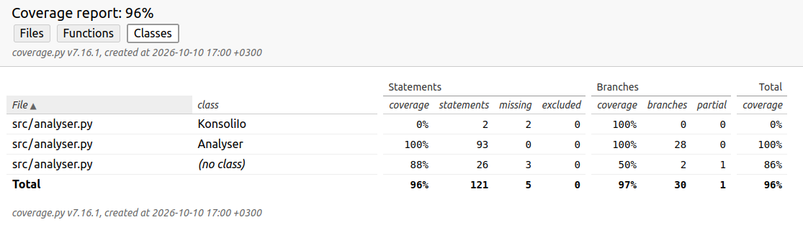

Testausasiat olivat minulle ihan uusia. Poetryyn törmäsin tällä kurssilla ensimmäistä kertaa, samoin yksikkötestaukseen.

Kattavuusraportti sanoo tällä hetkellä:

Name              Stmts   Miss Branch BrPart  Cover   Missing
-------------------------------------------------------------
src/analyser.py     121      5     30      1    96%   15, 18, 218-220
-------------------------------------------------------------
TOTAL               121      5     30      1    96%

## Yksikkötestit

Kaikki luokan Analyser metodit testataan jollakin tavalla. Yksikkötesteillä testaamattomaksi jäävät vain KonsoliIo-luokan metodit, jotka hoitavat syötteen kysymisen käyttäjältä ja tulostustoiminnot. Nämä liittyvät käyttöliittymään, ja näyttävät toimivan ohjelman käytön perusteella, joten näille ei tehty yksikkötestejä. Metodeita testataan melko kattavilla syötteillä. Tiedostonlatausvaiheessa tapahtuvat poikkeukset käsitellään ohjelmassa, ja niitä on myös testattu. Yksikkötesteissä on myös koko ohjelman läpikäyvä testi, jonka toteuttamiseksi estin plot-ikkunan avautumisen unittest.mock.patch-metodilla.

Yksikkötestien ajaminen tuottaa myös 14 varoitusta, jotka ovat tyyppiä PyparsingDeprecationWarning. Ymmärtääkseni nämä johtuvat siitä, että jouduin käyttämään kirjastoista vanhempia versioita sen vuoksi, että python-versioni oli 3.10. Ne varoittavat siis siitä, että jokin funktio ollaan uudemmissa versioissa jättämässä pois tai muuttamassa, joten nämä varoitukset eivät ole tämän ohjelman ajon kannalta relevantteja.

## Muut testit

Empiirisiä testejä on tehty niin, että on tutkittu ääninäytettä Audacityn Analyze->Plot spectrum -toiminnolla ja tsekattu, että käppyrästä tulee samannäköinen ja samat huipputaajuudet löytyvät. On myös tehty erään nettipalvelun avulla signaali, jossa on kaksi tunnettua taajuutta (200 ja 440Hz) ja tarkistettu, että tulokset vastaavat tätä.

Algoritmin kirjoituksen alkuvaiheessa fft-metodia testattiin tunnetulla syöte-muunnos-yhdistelmällä, joka oli [0,1,2,3] -> [6, -2+2j, -2, -2-2j]. Tämä laskettiin myös käsin paperille lähteistä löytyvän Signaalinkäsittelyn perusteet (Heikki Huttunen 2014) -kirjan menetelmällä sen varmistamiseksi, että algoritmi on ymmärretty oikein. 

